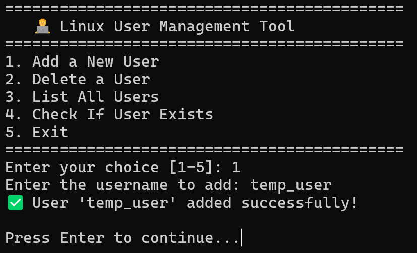
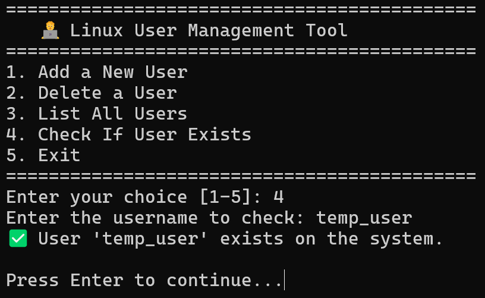
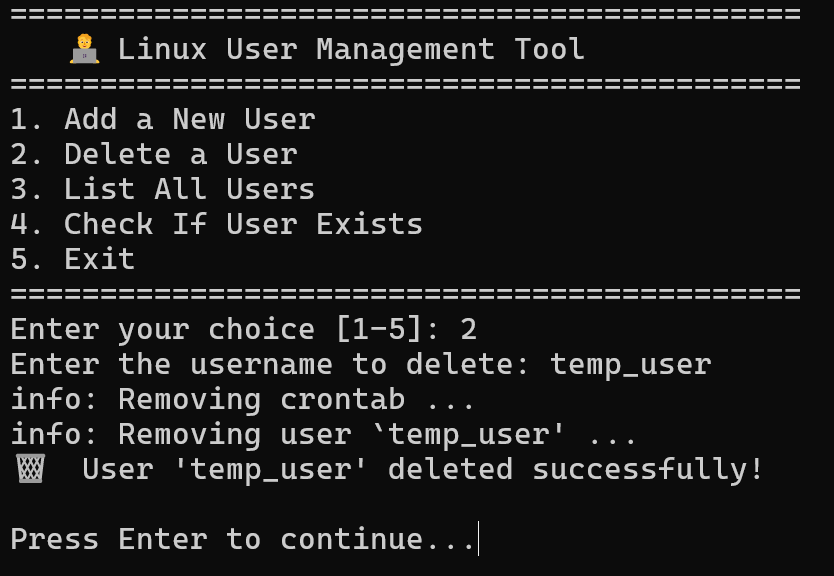
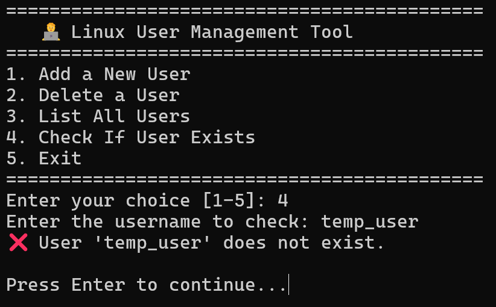
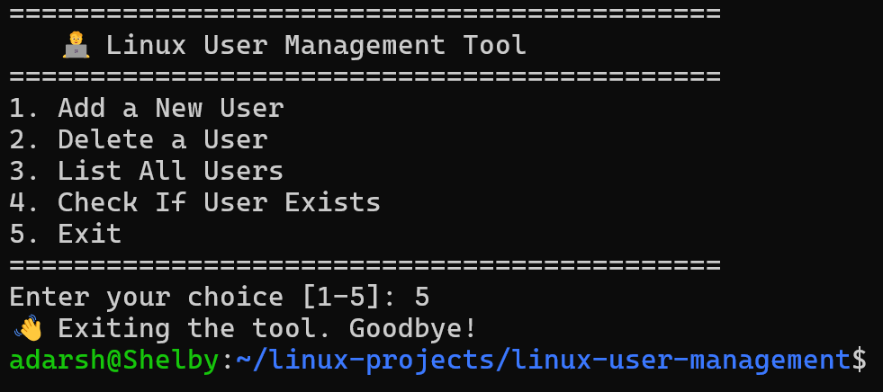

# 👥 Linux User Management Automation

### 👨‍💻 Author
**Adarsh Shivan**<br>GitHub: [https://github.com/adarshshivan](https://github.com/adarshshivan)

---

## 📘 Overview
The **Linux User Management Automation** project is a Bash-based script that simplifies creating, deleting, and managing users directly from the terminal.  
It provides both a **safe demo version** for beginners and a **real script** that performs actual user management operations.  
This project helps learners understand how Linux handles user creation, deletion, and permission control.

---

## 🧰 Features
- Add new users with a single command  
- Delete existing users safely  
- Manage user groups and home directories  
- Includes both **Demo (Safe Simulation)** and **Real** versions  
- Easy to use and modify for custom use cases  

---

## ⚙️ Tools & Technologies Used
- 🐧 Linux / WSL (Ubuntu)
- 💻 Bash Scripting
- 🔒 sudo & user management commands
- 🧾 GitHub (for version control)
- ✍️ VS Code / Nano (for editing scripts)

---

## 🧩 How It Works
### ▶️ Real Script
1. Prompts user for an action (Add, Delete, or List users).  
2. Executes Linux system commands such as `useradd`, `deluser`, and `getent passwd`.  
3. Requires `sudo` privileges since it affects real system users.  
4. Displays results clearly after each operation.  

### 🧪 Demo Script (Safe Simulation)
1. Simulates all operations without affecting your actual system.  
2. Uses `echo` statements to mimic the real output.  
3. Perfect for beginners to **learn safely** without admin risk.  

---

## ▶️ Usage Instructions

### 1️⃣ Make It Executable (Optional)
```bash
chmod +x user_management_real.sh
chmod +x user_management_demo.sh
```

### 2️⃣ Run the Script
🧪 For Safe Demo:
```bash
bash user_management_demo.sh
```
⚙️ For Real Execution:
```bash
sudo bash user_management_real.sh
```

---

### 📂 Example Output

### ▶️ After Running (Real Script)

Adding user:


Checking user:


Deleting user:


Cheking after deletion:


Exiting:



---

### 🎓 What I Learned

- Managing Linux users using terminal commands
- Using useradd, deluser, and permission control
- Writing safe simulation scripts for learners
- Structuring scripts with condition checks and prompts
- Improving Linux automation scripting skills

---

### 🧠 Project Summary

The Linux User Management Automation project demonstrates how user-related administrative tasks can be automated in Linux using Bash scripting.
It consists of two versions:

Safe Demo Version: Simulates the operations safely without modifying your system.

Real Version: Actually adds, deletes, and lists users using sudo commands.

This project showcases understanding of:

Linux user and permission management

Bash scripting logic and flow control

Building secure automation tools for administrators


